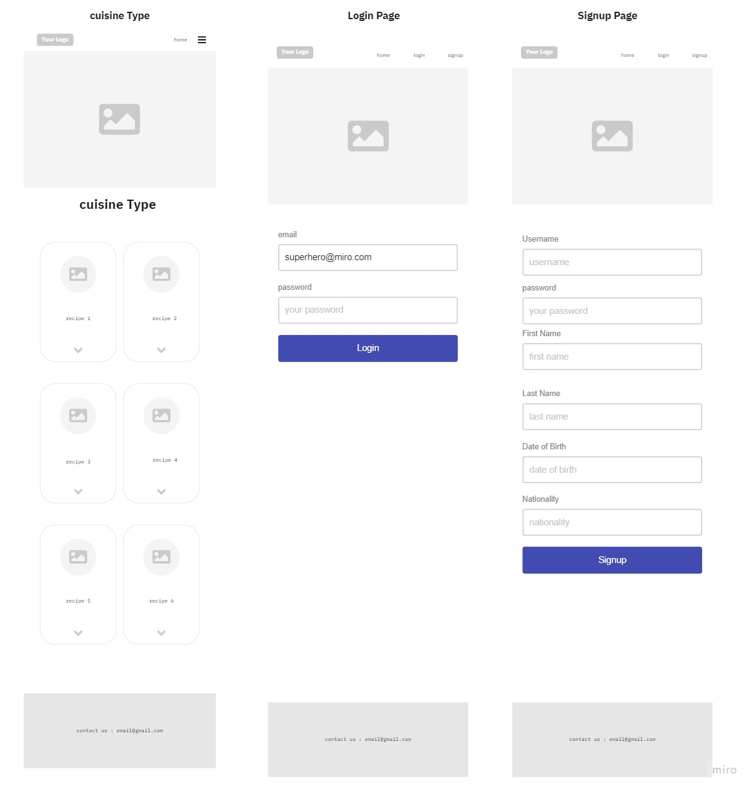
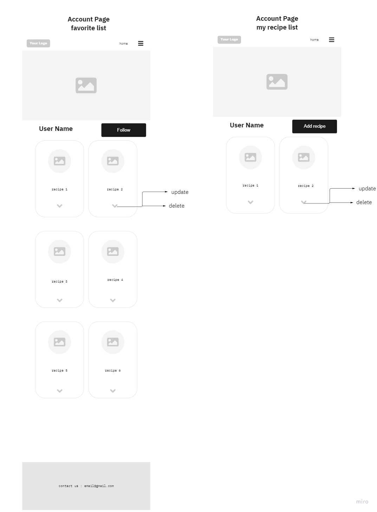
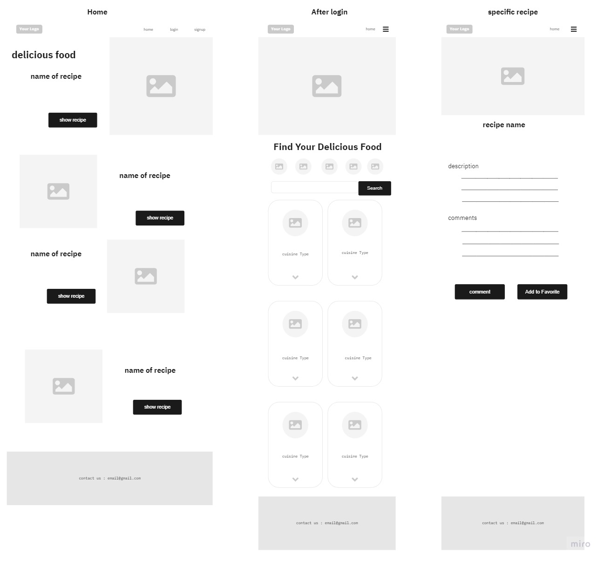
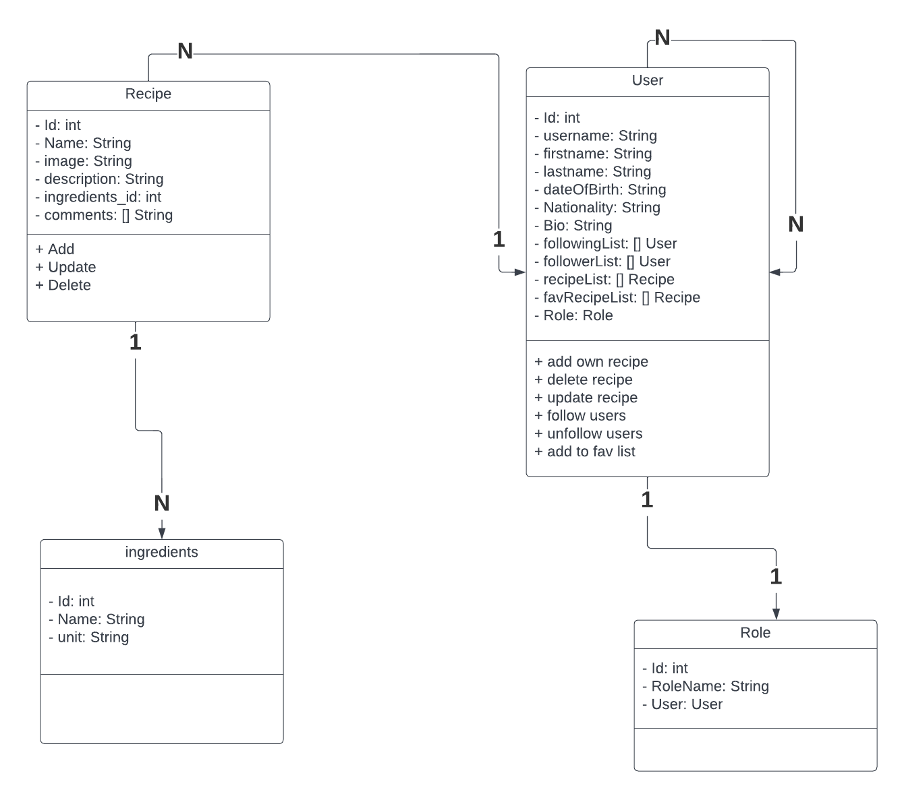
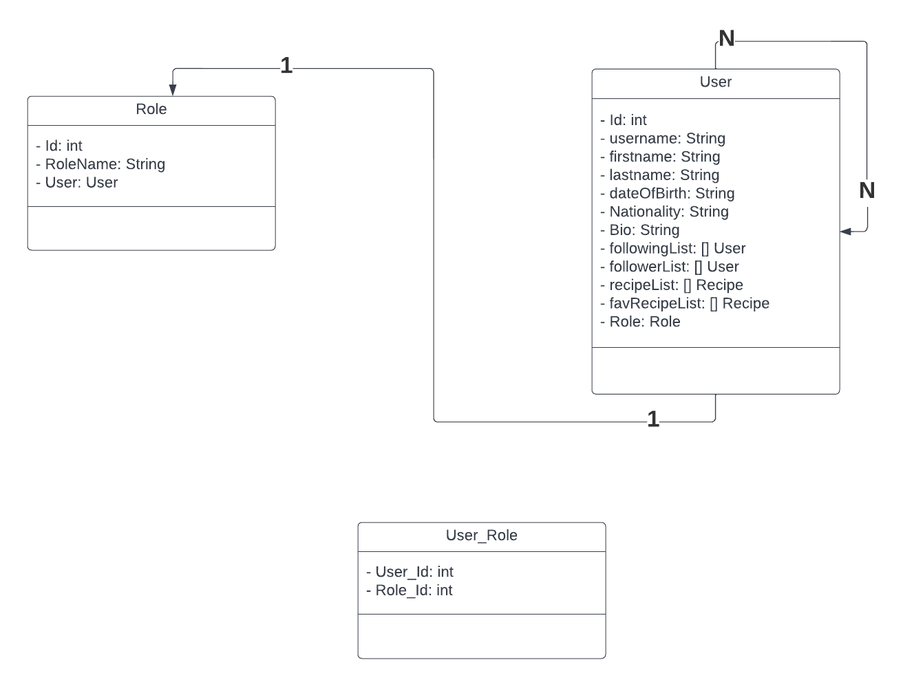

# Group2

## **Wireframe:**

---------------------------------------------------------------------------------------------------------------------------------------

# **User Stories**

## **Story #1**

----------------------------------------------------------------------------------------------------------------------------------------

#### **Searching**
#### search by ingredients as a user, I want the ability to make search by ingredients, so I can get the recipe that can I do quickly.

#### **Feature Tasks:**
#### **- Search for recipes using ingredients**

#### **Acceptance Tests:** make sure the user can search for a recipe by entering the ingredients.
#### Estimate your User Stories: extra Large.

## **Story #2**

----------------------------------------------------------------------------------------------------------------------------------------

#### **Add To Favorite.**
#### As a user, I want to add recipe to my favorite list so that I can back to this  recipe from my favorite list.

#### **Feature Tasks:**
#### **- Add the recipe to the favorite list.**
#### **- Save the favorite List changes.**

#### **Acceptance Tests:** Ensure that the recipe successfully save into database.
#### Estimate your User Stories : extra small.

## **Story #3**

----------------------------------------------------------------------------------------------------------------------------------------

#### **Add own recipes**
#### As a user, I want to add my own recipes, so that I have my recipes In my personal profile.

#### **Feature Tasks:**
#### **- Add recipes to your profile**

### **Acceptance Tests:** Ensure that the users can add their own recipes and show them in their personal profile
#### Estimate your User Stories : extra small.

## **Story #4**

----------------------------------------------------------------------------------------------------------------------------------------

#### **comment on recipe**
#### As a user, I want to add comment to a recipe.

#### **Feature Tasks:**
#### **- Add the comment to the recipe comments list.**
#### **- Save the comments List changes.**

#### **Acceptance Tests:** Ensure that the recipe comment successfully save into database.
#### Estimate your User Stories : extra small.

## **Story #5**

----------------------------------------------------------------------------------------------------------------------------------------

#### **follow other user**
#### as a user I can follow other users so that I can see their own recipes

#### **Feature Tasks :**
#### **- follow other users**

#### **Acceptance Tests:** Ensure that the user can follow specific user .
#### Estimate your User Stories : extra small.

## **Story #6**

----------------------------------------------------------------------------------------------------------------------------------------

#### **delete from favorite recipes so it can't be in favorite list any more**
#### as a user i can delete from favorite recipe

#### **Feature Tasks :**
#### **- delete recipes**

#### **Acceptance Tests:** Ensure that the user can delete specific recipe .
#### Estimate your User Stories : extra small.

----------------------------------------------------------------------------------------------------------------------------------------

## Domain Modeling

----------------------------------------------------------------------------------------------------------------------------------------

## DataBase Schema Diagram

